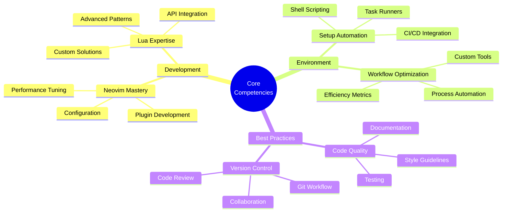

<div align="center">

[](https://git.io/typing-svg)

<a href="https://github.com/Pouya-bit">
    
</a>

<br>

[](https://github.com/Pouya-bit)
[](https://github.com/Pouya-bit)
[](https://github.com/sponsors/Pouya-bit)

</div>


### 🎯 Quick Impact

```typescript
class DevelopmentArchitect {
    readonly name = "Pouya";
    readonly title = "Development Environment Architect";
    readonly languages = ["Lua", "Shell", "JavaScript"] as const;
    readonly dailyTools = ["Neovim", "Git", "Linux"] as const;
    
    constructor() {
        this.mission = "Crafting Efficient Development Environments";
        this.passion = "Optimizing Developer Workflows";
        this.focus = "Neovim & Lua Ecosystem";
    }

    sayHi(): string {
        return "Let's create something extraordinary together! 🚀";
    }
}
```

### 🌟 Professional Summary

<table>
<tr>
<td width="50%">

<h3 align="center">Developer Profile 👨‍💻</h3>

- 🎯 **Specialization**: Development Environment Architecture
- 🛠️ **Expertise**: Neovim Configuration & Plugin Development
- 📚 **Focus Areas**: Performance Optimization & Workflow Automation
- 🌱 **Growth**: Continuous Learning & Open Source Contribution
- 🎨 **Philosophy**: "Efficiency through Elegant Design"

</td>
<td width="50%">

<h3 align="center">Impact & Achievements 🏆</h3>

- 🚀 Crafted Custom Neovim Configurations
- ⚡ Optimized Development Workflows
- 🔧 Built Automation Tools
- 📈 Enhanced Developer Productivity
- 🌟 Active Open Source Contributor

</td>
</tr>
</table>

### 🛠️ Technology Arsenal

<details>
<summary>🧰 Development Environment</summary>
<br>

<div align="center">


</div>

```lua
-- My Development Philosophy
return {
    editor = {
        primary = "Neovim",
        philosophy = "Minimal yet powerful",
        customization = "Fully configured for maximum efficiency"
    },
    workflow = {
        automation = "Extensive",
        efficiency = "Optimized",
        productivity = "Enhanced"
    }
}
```
</details>

<details>
<summary>⚙️ Development Tools</summary>
<br>

<div align="center">


</div>

```bash
# My Tooling Philosophy
TOOLS=(
    "Version Control: Git for precise history tracking"
    "Collaboration: GitHub for open source contribution"
    "Automation: Shell scripts for workflow optimization"
    "Integration: Seamless tool connectivity"
)
```
</details>

<details>
<summary>💻 Operating Systems</summary>
<br>

<div align="center">


</div>

```python
os_expertise = {
    "Linux": ["System Configuration", "Shell Scripting", "Performance Tuning"],
    "Windows": ["Development Setup", "WSL Integration", "PowerShell Automation"]
}
```
</details>

### 🎯 Featured Project

<div align="center">

[](https://github.com/Pouya-bit/starter-astronvim)

<table>
<tr>
<td width="50%">


### AstroNvim Configuration
A meticulously crafted development environment
</td>
<td width="50%">

### Key Features
- 🚀 Optimized Performance
- 🎨 Modern UI/UX
- 🔧 Custom Plugins
- ⚡ Efficient Workflows
</td>
</tr>
</table>

</div>

### 📊 Performance Metrics

<div align="center">
<table>
<tr>
<td width="50%">


</td>
<td width="50%">


</td>
</tr>
</table>
</div>

### 💡 Technical Expertise



### 📚 Learning & Growth

<div align="center">

```javascript
const professionalJourney = {
    currentFocus: [
        "Advanced Lua Design Patterns",
        "Neovim Plugin Architecture",
        "Performance Optimization Techniques"
    ],
    upcomingProjects: [
        "Custom LSP Implementation",
        "Workflow Automation Framework",
        "Developer Productivity Tools"
    ],
    continuousLearning: {
        technical: ["System Design", "API Architecture"],
        soft: ["Technical Writing", "Community Building"]
    }
};
```

</div>

---

<div align="center">

### 🤝 Let's Connect & Create

<a href="https://github.com/Pouya-bit">
    
</a>

<br>
<br>


</div>

<!-- Custom Footer -->
 