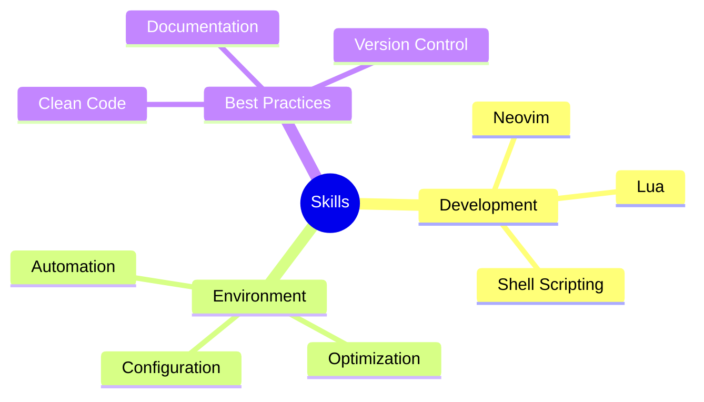

<div align="center">
  
# [](https://git.io/typing-svg)

[](https://git.io/typing-svg)

<a href="https://github.com/Pouya-bit">
    
</a>

</div>


### 🌟 Quick Facts

- 🚀 **Mission**: Crafting efficient development environments
- 💡 **Passion**: Optimizing developer workflows
- 🎯 **Focus**: Neovim & Lua ecosystem
- 🌱 **Growth**: Always learning, always improving
- ⚡ **Fun fact**: I believe coding is an art form, and my editor is my canvas

<br>

### 💫 About Me

I'm a developer with a passion for creating elegant and efficient development environments. My journey revolves around optimizing workflows and crafting tools that enhance developer productivity.

```python
class Pouya:
    def __init__(self):
        self.name = "Pouya"
        self.role = "Development Environment Architect"
        self.language_spoken = ["en_US", "fa_IR"]
        self.current_focus = "AstroNvim Configuration"
        
    def say_hi(self):
        print("Thanks for dropping by! Let's create something amazing together!")

me = Pouya()
me.say_hi()
```

### 🛠️ Tech Arsenal

<details>
<summary>🔧 Development Environment</summary>
<br>


</details>

<details>
<summary>🔨 Development Tools</summary>
<br>


</details>

<details>
<summary>💻 Operating Systems</summary>
<br>


</details>

### 🎯 Featured Project

<div align="center">

[](https://github.com/Pouya-bit/starter-astronvim)

</div>

#### 🚀 AstroNvim Configuration
A meticulously crafted Neovim setup designed for the modern developer:

```lua
-- Features at a glance
return {
  productivity = {
    "Custom LSP configurations",
    "Intelligent code completion",
    "Advanced syntax highlighting",
    "Efficient keybindings"
  },
  performance = {
    "Optimized startup time",
    "Lazy-loaded plugins",
    "Minimal memory footprint"
  },
  aesthetics = {
    "Modern UI components",
    "Custom colorschemes",
    "Sleek statusline"
  }
}
```

### 📊 GitHub Analytics

<div align="center">


</div>

### 💡 Expertise



### 🎯 Current Learning Path
```javascript
const learningPath = {
  current: [
    "Advanced Lua Patterns",
    "Neovim Plugin Architecture",
    "Modern Dev Workflows"
  ],
  upcoming: [
    "Contributing to Core Neovim",
    "Creating Custom LSP Servers",
    "Performance Optimization"
  ]
};
```

---

<div align="center">

### 🤝 Let's Create Something Amazing Together!

[](https://github.com/Pouya-bit)

<p align="center">

</p>

</div> 